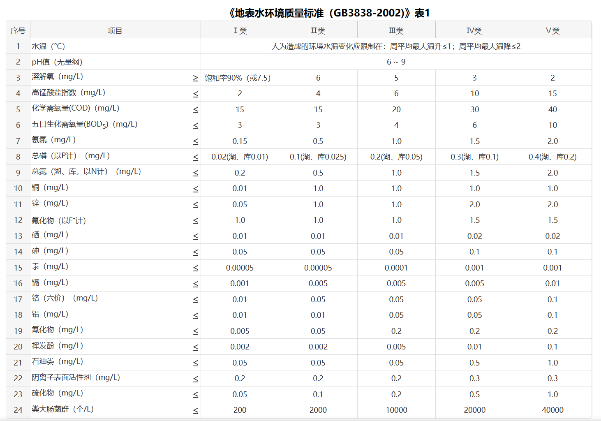

# 水质数据
水质数据来自中国环境检测总站，发布指标为水温、pH、溶解氧、电导率、浊度、高猛酸盐指数、氨氮、总磷、总氮共九项监测指标。
水质评价指标：地表水水质评价指标为《地表水环境质量标准(GB3838-2002)》表1中除水温、总氮、类大肠菌群以外的21项指标。国控水站水质评价指标为
pH、溶解氧、高锰酸盐指数、氨氮、总磷5项指标。
异常数据可以自行设置。

# 鱼类数据
Fish.csv文件包含种类、体重、体长、高度（背部到腹部的垂直距离，不常用）和宽度（鱼体中段的最大宽度）五种信息。
Ohio-River-main-stem-fish-population-data-1957-1999.xlsx等四个文件数据来自俄亥俄河流域水卫生委员会（ORSANCO）,表名含义在Field Explanations中有解释，主要使用到的信息为鱼类通用名称、种群数量、体长、体重等。
1. 唯一分配给每个采样事件的代码（通常由河流英里、岸边和日期的月、日、年形式组成）
2. 唯一分配给每个采样位置的代码（通常由河流缩写、河流英里和岸边组成）。该代码将鱼类种群数据链接到河岸和河道栖息地数据（也可在orsanco.org上获得）
3. 在GIS（NHD+）中分配给各个河流段的代码；此代码将此电子表格中的鱼类种群数据连接到另一个在线电子表格中的调查站点流域属性
4. 500米区域上游起点的纬度
5. 500米区域上游起点的经度
6. 采样位置的河流名称
7. 样本上游起点的河流英里（0 = 匹兹堡，981 = 俄亥俄河口；支流从河口向上游编号）
8. 左侧（LDB）或右侧（RDB）或两侧（BOTH）的下降岸边
9. 样本的航行池（两个大坝之间的区域，以下游大坝命名）
10. 捕捞类型。EF = 船上电捕鱼，RT = 船闸旋转网，BT = 底栖拖网，SE = 围网，HD = Hester-Dendy，BP = 背包式电捕鱼器
11. 沿海岸线的区域长度，以公里为单位
12. 样本的电捕鱼踏板时间，以秒为单位
13. 负责收集样本的组织
14. 收集样本的日历年份
15. 收集样本的日期
16. 样本收集时的水温度，以摄氏度为单位
17. 样本收集时的电导率，以us/cm为单位
18. 使用塞氏盘测量的样本收集时的水清澈度，以英寸为单位
19. 样本左侧下降岸边的州
20. 样本右侧下降岸边的州
21. 样本左侧下降岸边的县
22. 样本右侧下降岸边的县
23. 包含样本上游起点的USGS四分位数
24. 关于采样事件的任何评论
25. 将类群组织成系统发育顺序的唯一编号
26. 每个类群的通用名称
27. 基于AFS鱼类名称，第6版，2004年的每个类群的科学名称
28. 在样本中收集的每个类群的每个大小类别的个体总数
29. 每个个体的3厘米大小范围
30. 如果可用，每个个体的长度到最近的毫米
31. 在样本中收集的每个类群的每个大小类别（或长度）的所有个体的总重量
32. 如果重量是基于“模型”、“图表”或“其他”方法估算的。如果空白或“否”，则重量表示实际测量的数据点。
33. 关于每个样本中收集的任何个体的任何评论
34. 如果可用，物种凭证的类型。
35. 凭证标本/照片的唯一目录编号

# 传感器数据
传感器相关数据请大家自己寻找或生成，不一定要具体的设备编号，可以以“设备一”，“设备二”代称。